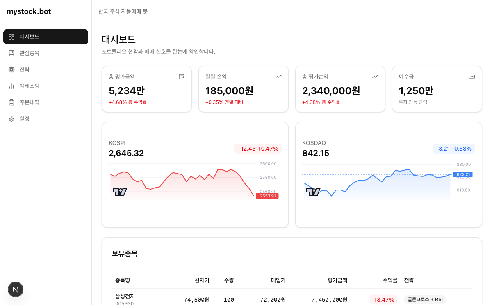
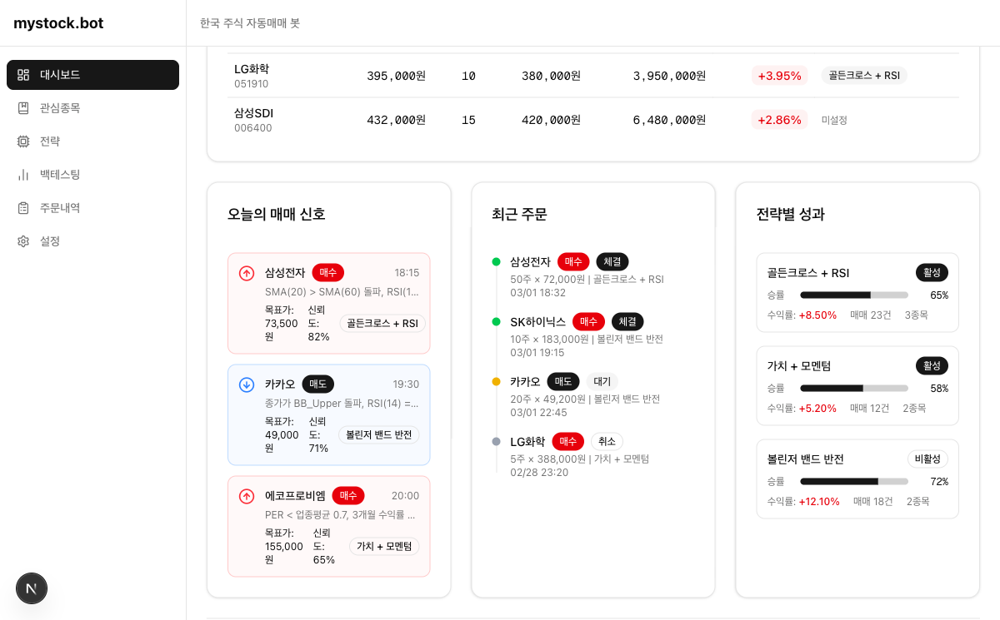
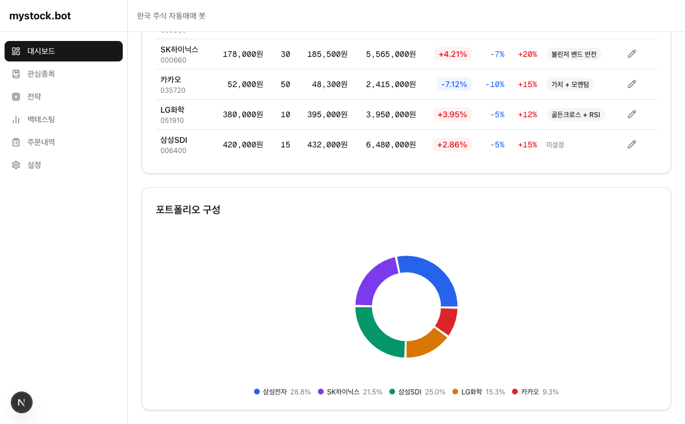
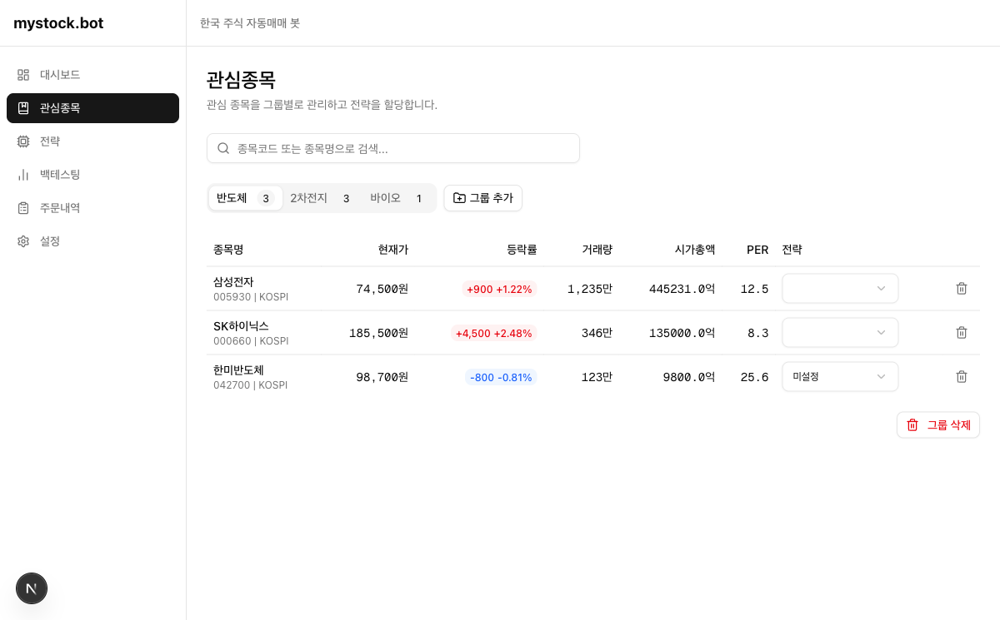
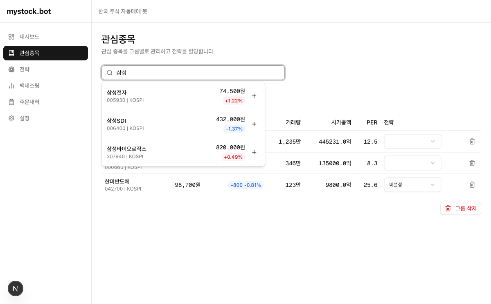
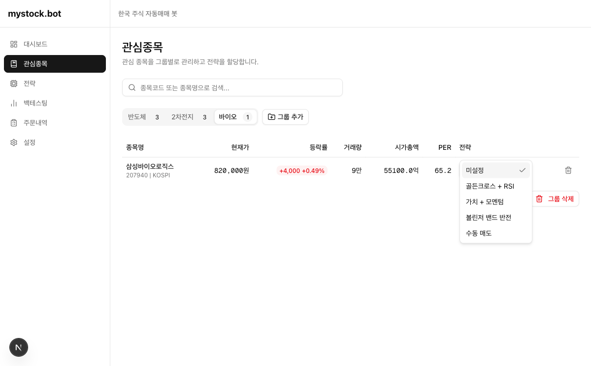
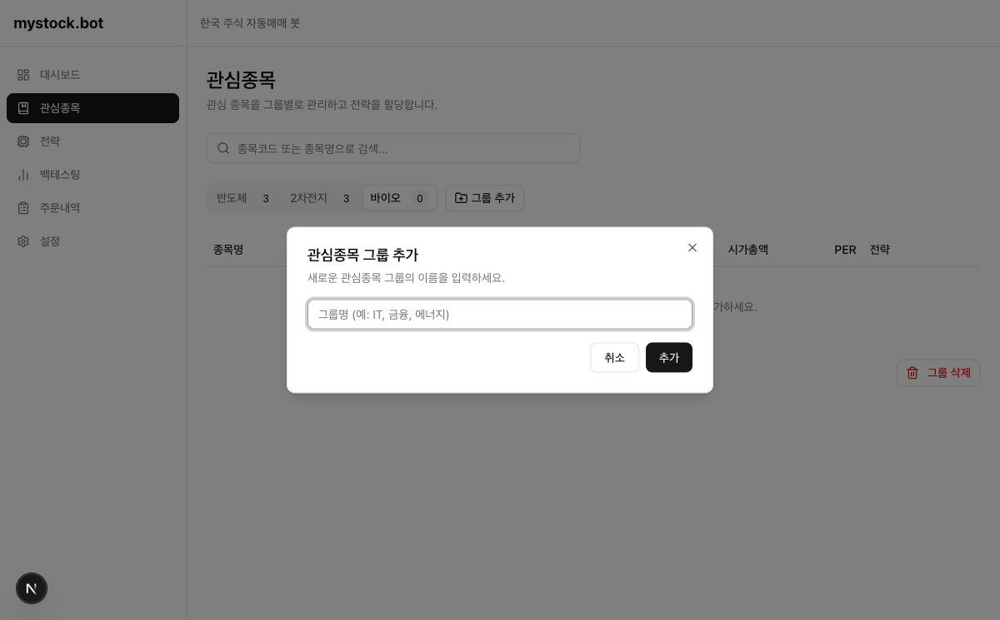
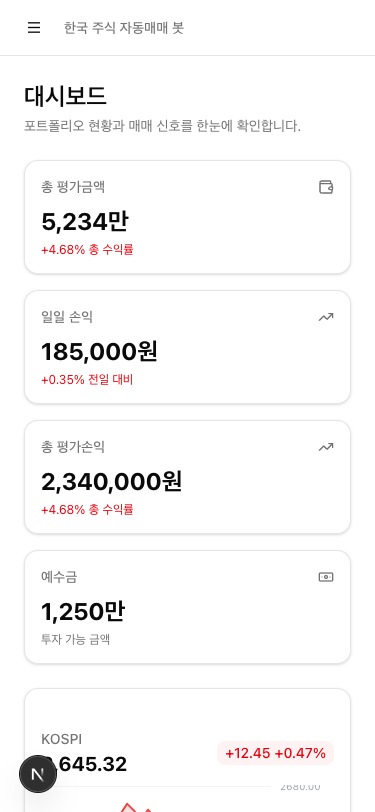
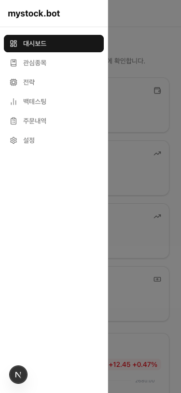
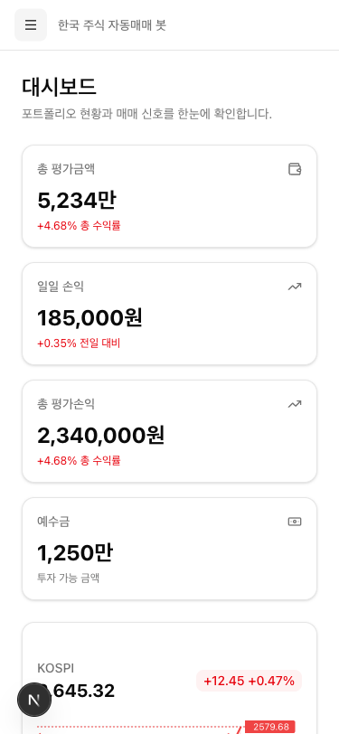

# Sprint 3 완료 검증 보고서

**검증 일시:** 2026-03-01
**검증 방법:** Playwright MCP 자동 검증
**검증 대상:** `http://localhost:3002` (Next.js 개발 서버)
**검증 결과:** ✅ 전체 통과

---

## 환경

| 항목 | 내용 |
|------|------|
| 브랜치 | `sprint3` |
| 프레임워크 | Next.js 16.1.6 (Turbopack) |
| 서버 포트 | 3002 (3000은 타 프로젝트 선점) |
| 데이터 | Mock 데이터 (백엔드 미연동) |
| 검증 도구 | Playwright MCP (`browser_navigate`, `browser_snapshot`, `browser_click`, `browser_type`, `browser_resize`, `browser_console_messages`) |

---

## Step 1: 대시보드 (`/dashboard`)

### 검증 결과: ✅ 전체 통과

| # | 항목 | 결과 | 비고 |
|---|------|------|------|
| 1 | 총 평가금액 카드 | ✅ | 5,234만 / +4.68% 표시 |
| 2 | 일일 손익 카드 | ✅ | 185,000원 / +0.35% 표시 |
| 3 | 총 평가손익 카드 | ✅ | 2,340,000원 / +4.68% 표시 |
| 4 | 예수금 카드 | ✅ | 1,250만 / 투자 가능 금액 표시 |
| 5 | KOSPI 미니 차트 | ✅ | Lightweight Charts v5 렌더링, 2,645.32 표시 |
| 6 | KOSDAQ 미니 차트 | ✅ | Lightweight Charts v5 렌더링, 842.15 표시 |
| 7 | 보유종목 테이블 (5개) | ✅ | 삼성전자·SK하이닉스·카카오·LG화학·삼성SDI |
| 8 | 수익률 색상 구분 | ✅ | 양수=빨강, 음수=파랑 |
| 9 | 매매 신호 3건 | ✅ | 삼성전자(매수)·카카오(매도)·에코프로비엠(매수) |
| 10 | 매매 신호 색상 | ✅ | 매수=빨강, 매도=파랑 |
| 11 | 최근 주문 타임라인 | ✅ | 체결·체결·대기·취소 4건 |
| 12 | 전략별 성과 카드 | ✅ | 골든크로스+RSI(65%), 가치+모멘텀(58%), 볼린저밴드(72%) |
| 13 | 포트폴리오 상세 테이블 | ✅ | 손절/익절/매도전략 인라인 표시 |
| 14 | 포트폴리오 도넛 파이차트 | ✅ | Recharts, 5종목 색상 분류 및 범례 표시 |

### 스크린샷

**상단 (4개 카드 + 지수 차트)**



**중단 (보유종목 테이블 + 매매 신호 + 주문 타임라인 + 전략 성과)**



**하단 (포트폴리오 상세 테이블 + 도넛 파이차트)**



---

## Step 2: 관심종목 (`/watchlist`)

### 검증 결과: ✅ 전체 통과

| # | 항목 | 결과 | 비고 |
|---|------|------|------|
| 1 | 검색창 렌더링 | ✅ | 종목코드/종목명 검색 placeholder |
| 2 | "삼성" 입력 시 드롭다운 | ✅ | 삼성전자·삼성SDI·삼성바이오로직스 3건 표시 |
| 3 | 검색 결과 종목 추가 | ✅ | + 버튼 클릭 → 현재 탭에 추가 (중복 방지 동작 확인) |
| 4 | 반도체 탭 전환 | ✅ | 삼성전자·SK하이닉스·한미반도체 3종목 |
| 5 | 2차전지 탭 전환 | ✅ | LG화학·삼성SDI·에코프로비엠 3종목 |
| 6 | 바이오 탭 전환 | ✅ | 삼성바이오로직스 1종목 |
| 7 | 전략 Select 드롭다운 | ✅ | 미설정·골든크로스+RSI·가치+모멘텀·볼린저밴드반전·수동매도 5개 옵션 |
| 8 | 휴지통 클릭 → 종목 삭제 | ✅ | 삼성바이오로직스 삭제 → 바이오 탭 카운트 1→0 변경 |
| 9 | "그룹 추가" 버튼 | ✅ | 모달 표시, 그룹명 입력 후 추가 → IT 탭 신규 생성 확인 |

### 스크린샷

**기본 화면 (반도체 탭)**



**"삼성" 검색 드롭다운**



**전략 Select 드롭다운**



**그룹 추가 모달**



---

## Step 3: 반응형 모바일 (375px)

### 검증 결과: ✅ 전체 통과

| # | 항목 | 결과 | 비고 |
|---|------|------|------|
| 1 | 뷰포트 375px 설정 | ✅ | `browser_resize(375, 812)` |
| 2 | 사이드바 숨겨짐 | ✅ | `complementary` 요소 스냅샷에서 제거 |
| 3 | 햄버거 메뉴(☰) 표시 | ✅ | 헤더 좌측 "메뉴 열기" 버튼 렌더링 |
| 4 | 햄버거 클릭 → 슬라이드 인 | ✅ | 사이드바 6개 메뉴 정상 표시, 배경 오버레이 확인 |
| 5 | 오버레이 클릭 → 사이드바 닫힘 | ✅ | `bg-black/50` 요소 클릭 이벤트로 닫힘 확인 |

### 스크린샷

**모바일 - 사이드바 닫힌 상태**



**모바일 - 사이드바 열린 상태 (슬라이드 인)**



**모바일 - 오버레이 클릭 후 닫힌 상태**



---

## Step 4: 콘솔 에러 확인

### 검증 결과: ✅ 에러 없음

| 페이지 | 에러 수 | 경고 수 |
|--------|---------|---------|
| `/dashboard` | 0 | 0 |
| `/watchlist` | 0 | 0 |

```
browser_console_messages(level: "error") → Total messages: 2 (Errors: 0, Warnings: 0)
```

> HMR connected, React DevTools 안내 메시지는 INFO/LOG 레벨로 에러 아님.

---

## 최종 체크리스트

| 항목 | 결과 |
|------|------|
| `npm install` 완료 | ✅ |
| `npm run dev` 정상 기동 | ✅ |
| 대시보드 8개 섹션 렌더링 | ✅ |
| 관심종목 검색/추가/삭제/탭/드롭다운 작동 | ✅ |
| 모바일(375px) 반응형 레이아웃 작동 | ✅ |
| 브라우저 콘솔 에러 없음 | ✅ |

**Sprint 3 완료 기준 전체 달성 ✅**
